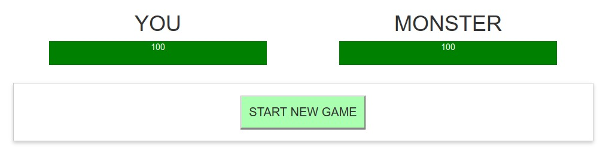
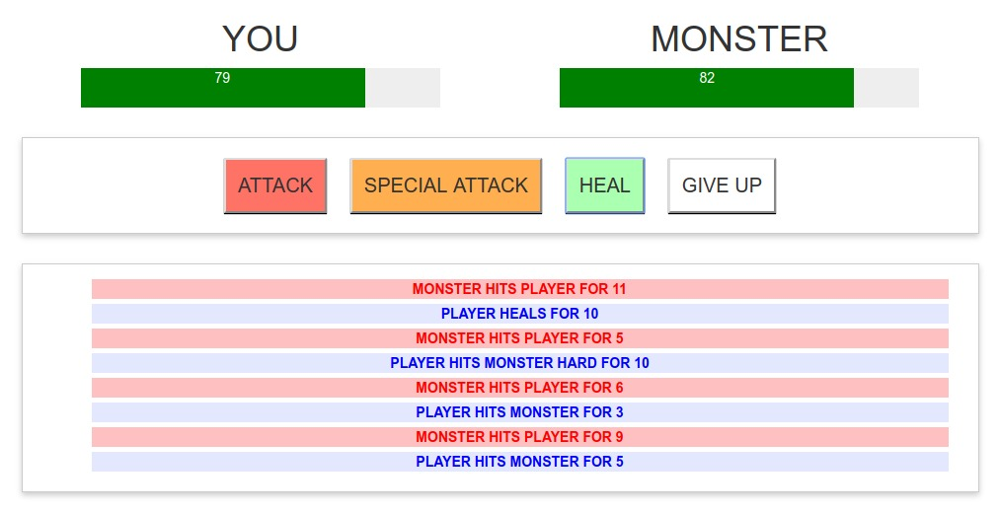
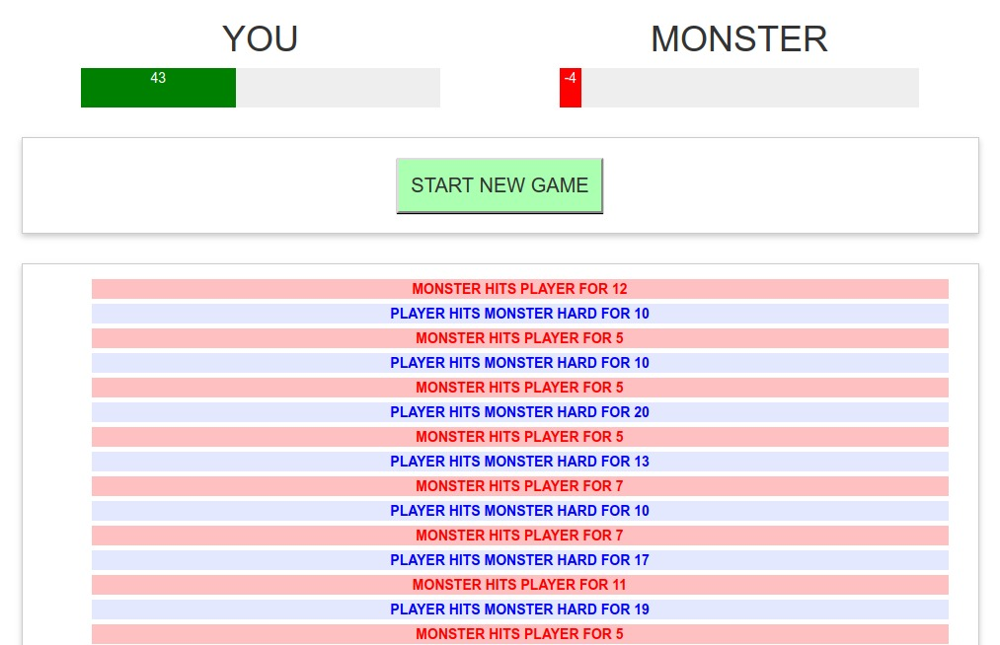
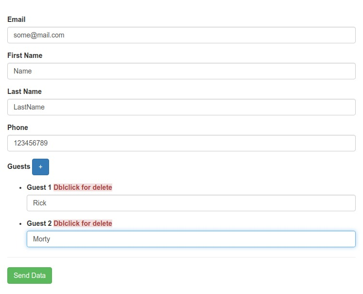
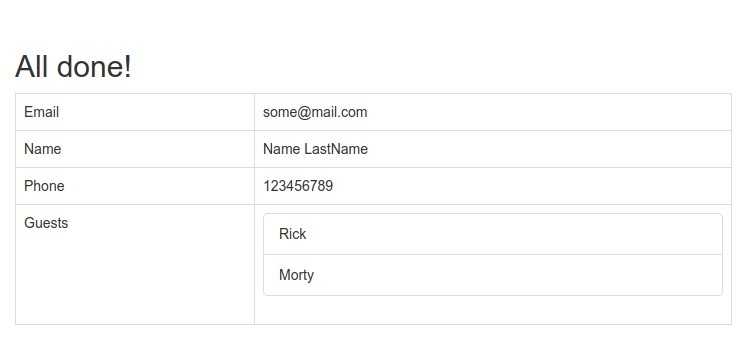
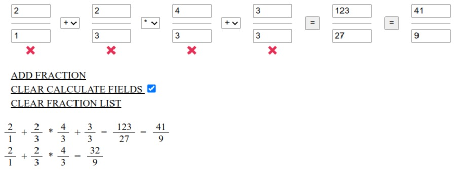
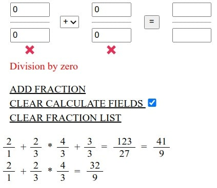

## Exercises for develop skills with Vue 2

Training tasks for practice working with `Vue.js`. But they will also be suitable for developing skills with other technologies. I'd be happy if someone comes in handy. Assignments were taken from various textbooks and video courses

### 1. Monster game
* Bring out the lives of the player and the monster.
* When you click on the `START NEW GAME` button, start the game. Remove the button and show the game control buttons.
* The monster must inflict damage from 5 to 12. At each turn of the player
* `ATTACK` button must inflict damage from 3 to 10
* `SPECIAL ATTACK` button must inflict damage from 10 to 20
* `HEAL` button restore player 10 health
* `GIVE UP` button stops the game and removes the control buttons
* each game action should be saved in the list of actions on the page
* After each turn there should be a check of the winner. Player or monster. Get a message for the player about who won through the `confirm` message

### 2. Work with forms

1. guest-form
* Fill in the form. 
* When the `Guests` button is clicked, an empty field is added to enter the guest. 
* By double-clicking on the Guest field, it is deleted. 
* After clicking the `Send Data` button, hide the form and show the completed table with data from the form
* All empty Guest fields are removed from the list after submitting the form

2. fraction-calculator

- When you click on `ADD FRACTION`, a new "fraction" box is added with select to select a mathematical operation
- At the bottom there is a button (red cross) to remove the superfluous "fraction"
- If you click on the `CLEAR CALCULATE FIELDS` button, all fields will be removed and replaced with default data.
  `SELECT` is used to save inputs locally.
- If you click on the `CLEAR FRACTION LIST` button, all stored computing will be removed
- All data is stored in `localStorage`.

## 3. Mini tasks
* contains tasks for exploring the main features Vue.js
